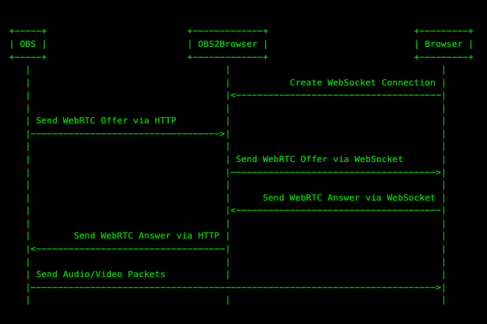
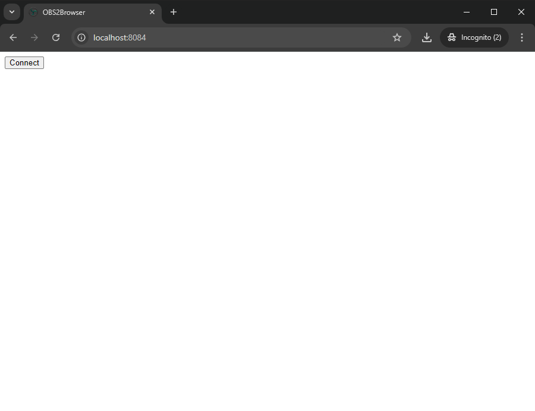
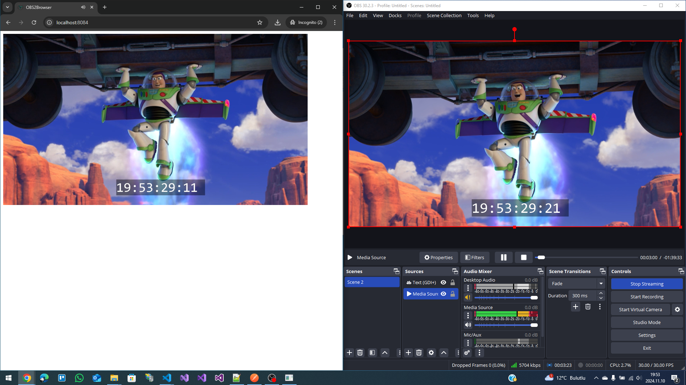

## <div align="center"><b><a href="README.md">English</a> | <a href="README_tr-TR.md">Türkçe</a></b></div>

# OBS2Browser CSharp

OBS2Browser allows you to connect OBS directly to your web browser. Your audio/video goes
directly into your browser via P2P. This will reduce your stream delay and save on bandwidth costs!
On a properly configured local machine you can expect to see sub-100ms times.

To do this we use the newly added WHIP output in OBS. With WebRTC you can now have a low latency P2P broadcast in OBS.

If you want to do a 'one to many' broadcast [Broadcast Box](https://github.com/glimesh/broadcast-box) might be a better option.
OBS2Browser can only support one viewer at a time, while Broadcast Box has no upper limit.

## How it works

`OBS2Browser` facilitates the handshake between your browser and OBS. It exists just to transport two text messages.
After this handshaking is done `OBS2Browser` is never used. All of the media is exchanged directly between OBS and your browser.



To confirm this you can shut down `OBS2Browser` after the session has started. Your browser will continue to play frames from OBS.

## How to use

### Run `OBS2Browser`

Execute `go run github.com/sean-der/OBS2Browser@latest` by default it listens on port 8084. You can change that by setting the environment variable `HTTP_ADDR`.

You should see a log line for the HTTP Server starting

```console
info: Microsoft.Hosting.Lifetime[14]
      Now listening on: http://0.0.0.0:8084
Microsoft.Hosting.Lifetime: Information: Now listening on: http://0.0.0.0:8084
```

### Open in your browser

Open [http://localhost:8084](http://localhost:8084) and press the `Connect` button.



You will see a log in `OBS2Browser` that says the WebSocket has connected

```console
WSHub:OnConnectedAsync -> nx0UTsylvcZlMf2XzIYZUg
```

### Broadcast from OBS

Next configure OBS to the following

* **Service** - WHIP
* **Server** - http://localhost:8084/whip
* **Bearer Token** - (None)


### Enjoy!

Press `Start Streaming`



## References

* [Github OBS2Browser GO (By Sean-Der)](https://github.com/Sean-Der/OBS2Browser)
* [OBS Studio](https://obsproject.com/tr)
* [Visual Studio Code](https://code.visualstudio.com)
