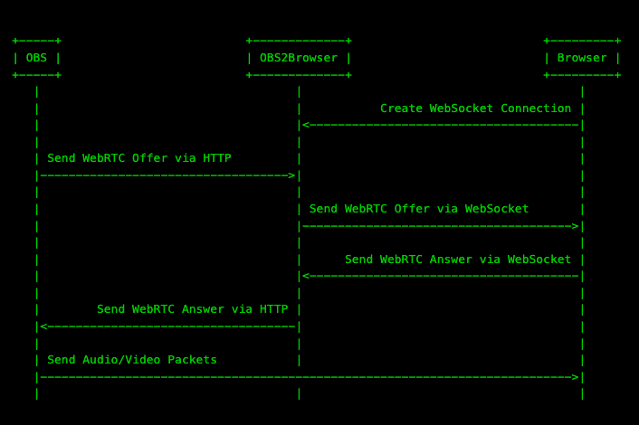
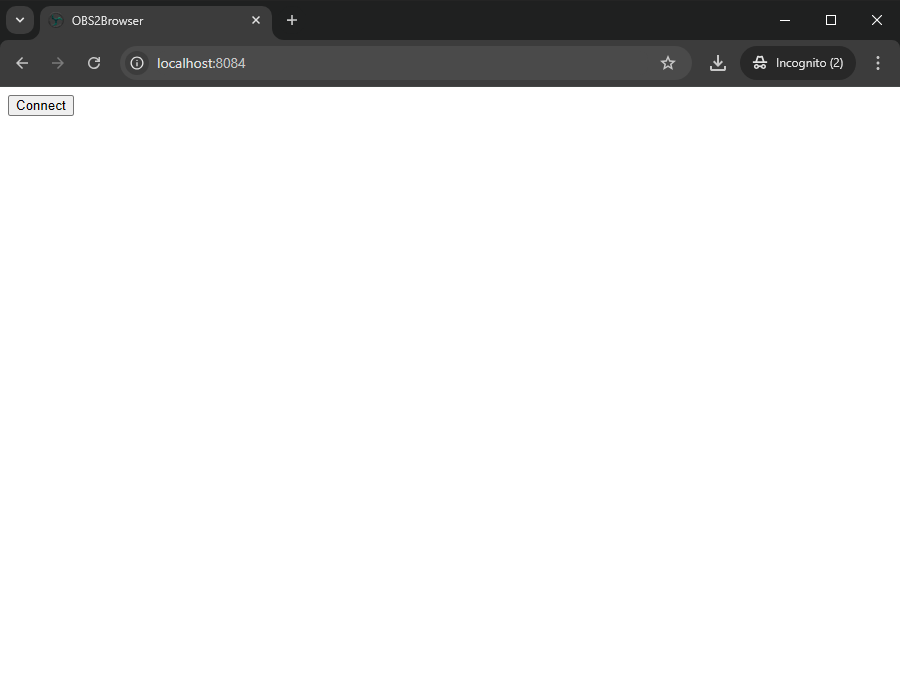
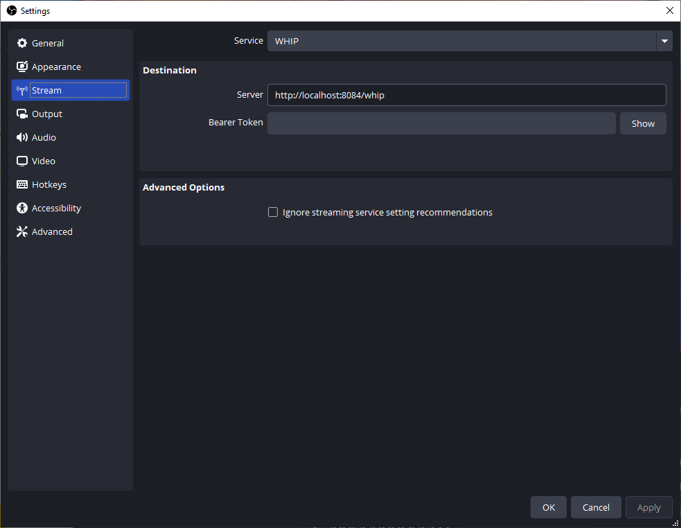
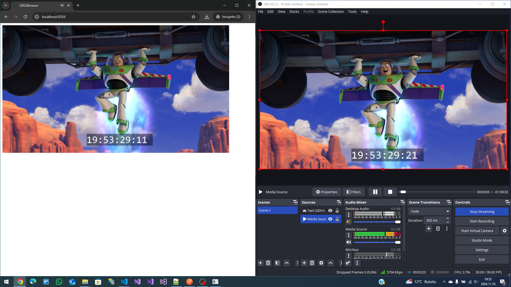

## <div align="center"><b><a href="README.md">English</a> | <a href="README_tr-TR.md">Türkçe</a></b></div>

# OBS2Browser CSharp

OBS2Browser, OBS'yi doğrudan web tarayıcınıza bağlamanızı sağlar. Ses/videonuz doğrudan P2P aracılığıyla tarayıcınıza gider. Bu, akış gecikmenizi azaltacak ve bant genişliği maliyetlerinden tasarruf sağlayacaktır! Doğru şekilde yapılandırılmış bir yerel makinede 100 ms'nin altındaki süreleri görmeyi bekleyebilirsiniz.

Bunu yapmak için OBS'de yeni eklenen WHIP çıkışını kullanıyoruz. WebRTC ile artık OBS'de düşük gecikmeli P2P yayınına sahip olabilirsiniz.

'Birden çoğa' yayın yapmak istiyorsanız [Broadcast Box](https://github.com/glimesh/broadcast-box) daha iyi bir seçenek olabilir.
OBS2Browser aynı anda yalnızca bir izleyiciyi destekleyebilirken, Broadcast Box'ın üst sınırı yoktur.

## Nasıl çalışır

`OBS2Browser` tarayıcınız ve OBS arasındaki el sıkışmayı kolaylaştırır. Sadece iki metin mesajını iletmek için vardır.
Bu el sıkışma yapıldıktan sonra `OBS2Browser` asla kullanılmaz. Tüm medya doğrudan OBS ve tarayıcınız arasında değiştirilir.



Bunu doğrulamak için oturum başladıktan sonra `OBS2Browser`'ı kapatabilirsiniz. Tarayıcınız OBS'den kareleri oynatmaya devam edecektir.

## Nasıl kullanılır

### `OBS2Browser` Çalıştır

Visual Studio'da `F5` tuşuna basarak uygulamayı çalıştırın.

HTTP Sunucusunun başlatıldığını anlamak için bir günlük satırı görmelisiniz.

```console
info: Microsoft.Hosting.Lifetime[14]
      Now listening on: http://0.0.0.0:8084
Microsoft.Hosting.Lifetime: Information: Now listening on: http://0.0.0.0:8084
```

### Tarayıcınızda açın

[http://localhost:8084](http://localhost:8084) adresini açın ve `Bağlan` butonuna basın.



`OBS2Browser`da WebSocket'in bağlandığını belirten bir günlük göreceksiniz.

```console
WSHub:OnConnectedAsync -> nx0UTsylvcZlMf2XzIYZUg
```

### OBS'den Yayın Yapın

Daha sonra OBS'yi aşağıdaki şekilde yapılandırın.

* **Service** - Hizmet olarak `WHIP` seçin.
* **Server** - Sunucu olarak 'http://localhost:8084/whip' adresini yazın.
* **Bearer Token** - (None) boş bırakın.



### Eğlenin

`Yayını Başlat`a (Start Streaming) basın.



## Referanslar

* [Github OBS2Browser GO (By Sean-Der)](https://github.com/Sean-Der/OBS2Browser)
* [OBS Studio](https://obsproject.com/tr)
* [Visual Studio Code](https://code.visualstudio.com)
